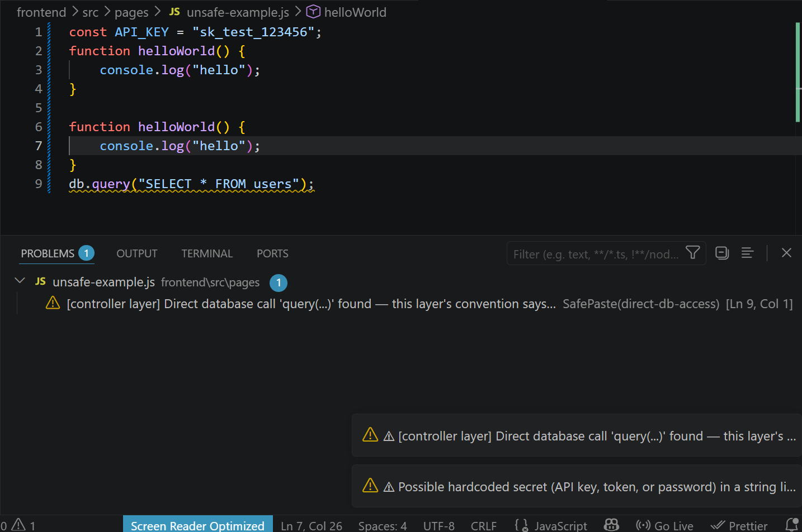
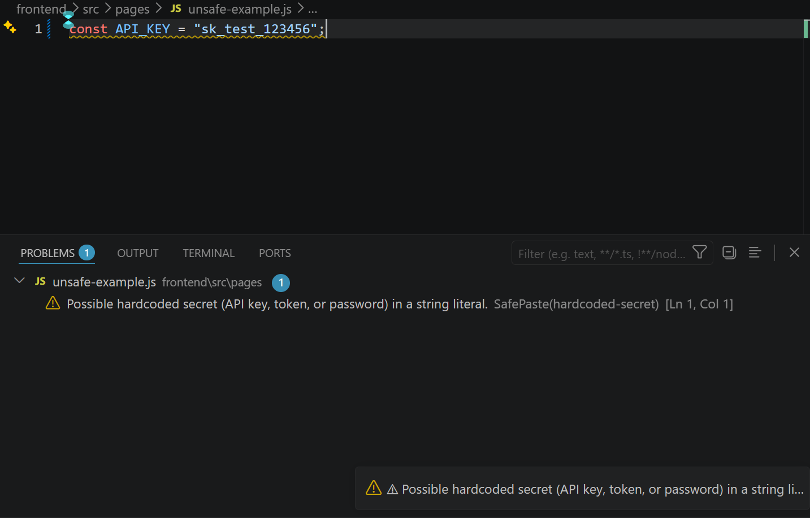
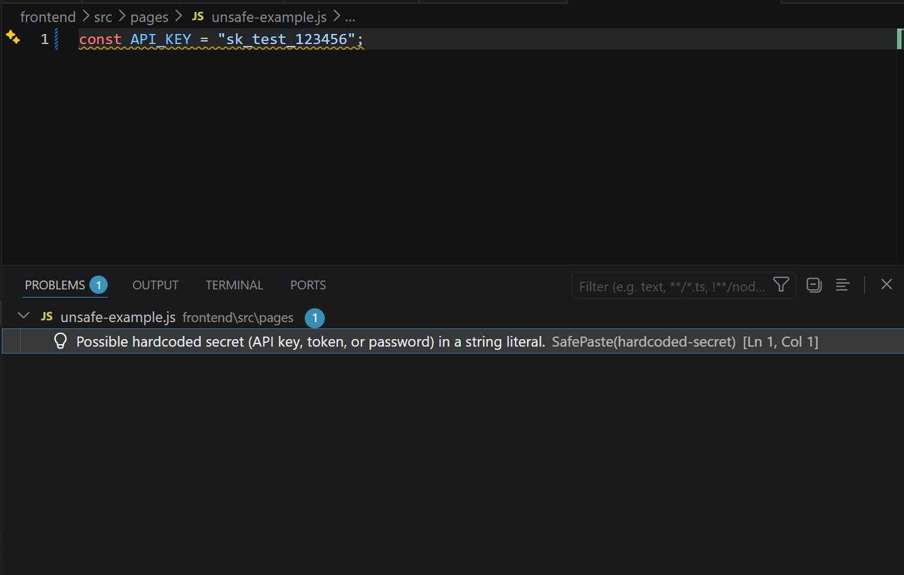
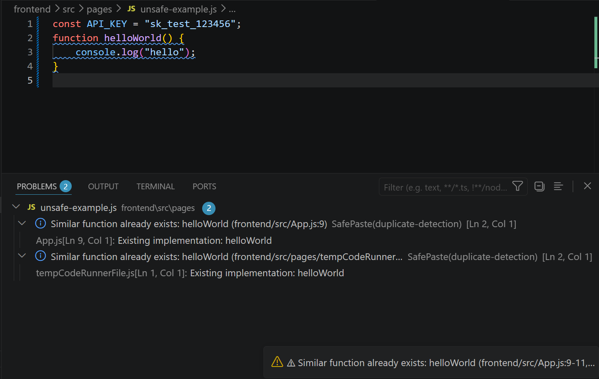
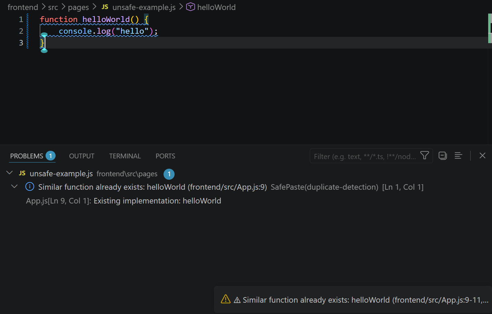

# 🛡️ SafePaste AI


**SafePaste AI** is a VS Code extension that acts as a safety layer for AI-generated code. It sits between *copy* and *paste* — automatically checking pasted code for duplicate logic, security risks, and architecture violations before you commit to it, without ever modifying your code or getting in your way.

---

# 📸 Screenshots

## 🚀 SafePaste AI in Action

This example demonstrates SafePaste AI analyzing AI-generated code **before it reaches your codebase**. The extension detects security issues, duplicate implementations, and architecture rule violations directly inside VS Code.



### ✨ What SafePaste detects

<table>
<tr>
<td width="50%">

### 🔐 Hardcoded Secret Detection

Warns when API keys, tokens, or passwords are committed directly into source code.



</td>

<td width="50%">

### 🔁 Duplicate Function Detection

Detects implementations that already exist elsewhere in the project using semantic similarity.



</td>
</tr>

<tr>
<td width="50%">

### 🏗️ Architecture Rule Enforcement

Flags code that violates project architecture rules, such as direct database access from controllers.



</td>

<td width="50%">

### ⚠️ Native VS Code Diagnostics

Displays findings directly inside the Problems panel with editor highlights and notifications.



</td>
</tr>
</table>

> SafePaste AI works entirely inside VS Code, helping developers identify potential issues before AI-generated code becomes part of the codebase.

---
---

## 📌 Problem Statement

Modern development leans heavily on AI code generation — ChatGPT, Copilot, Cursor, Claude — and the workflow has quietly become:

```
Generate code → Copy → Paste → Hope it works
```

That last step is the risky one. Pasted AI-generated code can silently introduce:

- **Duplicate logic** — a function that already exists somewhere else in the codebase, now maintained in two places.
- **Hardcoded secrets** — API keys, tokens, or passwords the model happened to include or you forgot to parameterize.
- **Unsafe patterns** — SQL built from string concatenation, `eval()`, unguarded filesystem writes, deprecated crypto APIs.
- **Architecture violations** — a controller reaching directly into the database instead of going through the service layer your team agreed on.

None of these are caught by the AI tool that generated the code — it has no idea what your repository already contains or how your team structures it. By the time a linter or a code reviewer catches it, it's already merged.

## 💡 Solution

SafePaste AI closes that gap. It hooks into VS Code's paste event directly — no extra step, no separate command required — and runs three independent, purpose-built checks against whatever just landed in the editor:

1. **Does this logic already exist elsewhere in the repo?** (semantic similarity search against an index of every function in the codebase)
2. **Does this code contain a known-risky pattern?** (static analysis for secrets, injection risks, dangerous calls, deprecated APIs)
3. **Does this code violate the repo's own declared architecture?** (convention-based layering checks, e.g. Controller → Service → Repository)

Findings are surfaced through VS Code's native UI — a notification, the Output panel, and the Problems panel — and the pasted code is **never** altered automatically. SafePaste AI tells you what it found; you decide what to do about it.

---

## ✨ Features

| Feature | Description |
|---|---|
| 🔌 **Python worker communication** | A long-lived Python process managed over stdio using a custom JSON Lines protocol — no HTTP server, no open port. |
| 📇 **Repository indexing** | One-time scan of a JS/TS repository into searchable, function-level chunks. |
| 🧠 **Semantic duplicate detection** | Embeds every indexed function with `sentence-transformers` and finds near-duplicates via vector similarity search. |
| ✂️ **AST-based code chunking** | Uses the TypeScript Compiler API to extract function declarations, class methods, and arrow-function assignments — not regex. |
| ✍️ **Automatic paste detection** | Hooks into VS Code's Document Paste API to analyze pasted code the moment it lands — no command, no extra click. |
| 🔑 **Hardcoded secret detection** | Flags API keys, tokens, passwords, and private key material in pasted code. |
| 🧯 **Static safety analysis** | Also catches SQL injection patterns, dangerous calls (`eval`, `exec`, unsafe filesystem operations), and deprecated APIs. |
| 🏗️ **Architecture rule checking** | Checks pasted code against a repo-declared layering convention (`safepaste.config.json`) — e.g. flags direct database access inside a controller. |
| 🔔 **VS Code notifications** | One combined, human-readable warning per paste — silent when nothing is found. |
| 📋 **Output panel** | A full, sectioned report (Duplicate Detection / Safety Analysis / Architecture Compatibility) for every check. |
| 🩺 **Problems panel diagnostics** | Findings appear as native VS Code diagnostics, with duplicate findings linking back to the original implementation. |
| 📊 **Status bar updates** | Live status for indexing and manual analysis (`Ready` → `Indexing...` → `Indexed N chunks`). |
| ⏳ **Progress notifications** | Staged progress feedback during repository indexing. |

---

## 🏛️ System Architecture

```
VS Code Extension
        ↓
   AST Chunking
        ↓
  Python Worker
        ↓
   Embeddings
        ↓
Duplicate Detection
        ↓
 Safety Analysis
        ↓
Architecture Analysis
        ↓
 Results Formatter
        ↓
Notifications + Output Panel + Problems Panel
```

**One important nuance the linear diagram simplifies:** only *duplicate detection* actually crosses into the Python worker. Safety analysis and architecture analysis are synchronous, local TypeScript operations — AST parsing and pattern matching — that never touch the Python process or the network. This was a deliberate design decision: the only step that genuinely needs machine learning (semantic similarity) pays the cost of a worker round-trip; everything else stays instant.

```
                 ┌──────────────────────────────┐
                 │   VS Code Extension (TS)      │
                 │                                │
   Paste event → │  AST Chunking (indexing only) │
                 │  Safety Analysis  (local)      │
                 │  Architecture Analysis (local) │
                 │  Duplicate Check  ──┐          │
                 │                     │          │
                 │  Results Formatter ←┘          │
                 │  Notifications / Output /      │
                 │  Problems Panel                │
                 └──────────────┬─────────────────┘
                                │ JSON Lines over stdio
                 ┌──────────────▼─────────────────┐
                 │   Python Worker (long-lived)     │
                 │   sentence-transformers          │
                 │   ChromaDB (local, embedded)      │
                 └───────────────────────────────────┘
```

---

## 🧰 Tech Stack

**Frontend / Extension**

| Technology | Purpose |
|---|---|
| TypeScript | Extension implementation |
| VS Code Extension API | Document Paste API, Diagnostics, Status Bar, Progress API |

**Analysis**

| Technology | Purpose |
|---|---|
| TypeScript Compiler API | AST-based chunking and static rule checks (no regex-only parsing) |

**Python**

| Technology | Purpose |
|---|---|
| sentence-transformers | Generates semantic embeddings for code |
| `all-MiniLM-L6-v2` | The embedding model used |
| ChromaDB | Local, embedded vector store (no server) |

**Communication**

| Technology | Purpose |
|---|---|
| JSON Lines protocol | `{ id, type, payload }` request / `{ id, ok, result|error }` response envelope |
| Child Process IPC | stdin/stdout pipe to a long-lived Python process — no HTTP, no open port |

---

## 📁 Project Structure

```
safepaste-ai/
├── extension/
│   └── src/
│       ├── extension.ts            # Activation, commands, paste handler, orchestration
│       ├── pythonWorker.ts         # Spawns and talks to the Python worker over stdio
│       ├── protocol.ts             # Shared JSON Lines message envelope types
│       ├── chunker/
│       │   ├── index.ts            # Public entry point: repo path → FunctionChunk[]
│       │   ├── fileWalker.ts       # Finds JS/TS/JSX/TSX files, skips node_modules etc.
│       │   └── astChunker.ts       # TS Compiler API-based function extraction
│       ├── astHelpers.ts           # Shared AST parsing utilities
│       ├── safetyAnalyzer.ts       # Static safety rules (secrets, injection, deprecated APIs)
│       ├── architectureAnalyzer.ts # Layer-violation checks against declared config
│       ├── architectureConfig.ts   # Loads & caches safepaste.config.json
│       ├── resultsFormatter.ts     # Pure, analyzer-agnostic text formatting
│       └── diagnostics.ts          # Converts findings into vscode.Diagnostic objects
│
└── python-worker/
    ├── worker.py                   # stdio message loop, routes `type` to a handler
    ├── embedder.py                 # sentence-transformers wrapper
    ├── store.py                    # ChromaDB wrapper (embedded, local)
    └── handlers.py                 # Business logic for `index` and `check_duplicates`
```

---

## ⚙️ Installation

**Prerequisites:** Node.js 18+, Python 3.9+, VS Code 1.90+

```bash
# 1. Clone the repository
git clone https://github.com/<your-username>/safepaste-ai.git
cd safepaste-ai

# 2. Install the extension's dependencies
cd extension
npm install

# 3. Install the Python worker's dependencies
cd ../python-worker
pip install -r requirements.txt --break-system-packages

# 4. Open the project in VS Code and launch the Extension Development Host
cd ..
code .
```

Then press **F5** in VS Code to launch a new Extension Development Host window with SafePaste AI active.

> **Note:** the first time the Python worker embeds anything, `sentence-transformers` downloads the `all-MiniLM-L6-v2` model weights (~80MB) — this requires an internet connection once.

## 🚀 Usage

1. Open a JavaScript/TypeScript project in the Extension Development Host.
2. Run **`SafePaste: Index Repository`** from the Command Palette — this scans and embeds every function in the workspace. Re-run it whenever the codebase changes significantly.
3. Copy code from anywhere (ChatGPT, Copilot, another file) and **paste it normally** — no extra step. SafePaste AI analyzes it automatically.
4. If something's worth flagging, you'll see a warning notification. Open the **Output panel** (`SafePaste AI` channel) for the full report, or the **Problems panel** for inline diagnostics.
5. To check a specific selection on demand, run **`SafePaste: Check Selection for Duplicates`**.

**Optional:** to enable architecture checking, add a `safepaste.config.json` file to your workspace root:

```json
{
  "layers": [
    { "name": "controller", "folders": ["src/controllers"], "forbiddenPatterns": ["direct-db-access"] },
    { "name": "service", "folders": ["src/services"], "forbiddenPatterns": [] }
  ]
}
```

Without this file, architecture checking is silently skipped — every other feature works regardless.

---

## 🔍 Example Detections

### 1. Hardcoded API Key

```javascript
const config = {
  apiKey: "sk_live_51H8x9K2mN3pQ7r"
};
```

> ⚠ **1 safety issue: Possible hardcoded secret (API key, token, or password) in a string literal.**

### 2. Direct Database Access (Architecture Violation)

Pasted into `src/controllers/UserController.js`, with a config declaring that layer's `forbiddenPatterns: ["direct-db-access"]`:

```javascript
function getUser(id) {
  return db.query("SELECT * FROM users WHERE id = ?", [id]);
}
```

> ⚠ **[controller layer] Direct database call 'query(...)' found — this layer's convention says database access should go through a service/repository instead.**

The same code pasted into `src/services/UserService.js` produces **no warning** — the convention allows database access there.

### 3. Duplicate Function

If the repository already contains:

```javascript
// src/utils/format.ts
export function formatUserName(first, last) {
  return `${first} ${last}`;
}
```

...and this gets pasted elsewhere:

```javascript
function formatFullName(firstName, lastName) {
  return firstName + " " + lastName;
}
```

> ⚠ **Similar function already exists: formatUserName (src/utils/format.ts:2)**

---

## 🧗 Challenges

- **Choosing a communication architecture.** The initial design used a FastAPI HTTP backend. It was replaced with a long-lived Python child process communicating over stdin/stdout using JSON Lines — the same pattern used by the Language Server Protocol — eliminating an open network port entirely while keeping the embedding model warm in memory between requests.
- **A tokenizer crash with no obvious cause.** Indexing a real repository intermittently failed with an opaque `TypeError` from the embedding library on one specific chunk out of dozens. Root-causing it required distinguishing "Python considers this a valid string" from "the underlying Rust tokenizer can encode it" — two different guarantees. The fix layered text sanitization with a per-chunk fallback, so one problematic chunk can never again take down an entire indexing run.
- **Making "automatic" actually reliable.** An early approach inferred paste events by diffing document changes — indistinguishable from fast typing or an AI inline-completion accept. Switching to VS Code's purpose-built Document Paste API replaced inference with certainty.
- **Keeping notifications useful, not annoying.** Every check enforces a strict rule: stay completely silent unless there's something worth reporting, and never claim a *skipped* check (e.g. no workspace open, paste too short to embed) was actually *clean*.
- **Positioning diagnostics correctly.** Analyzers report line numbers relative to the pasted snippet, not the document. Getting a squiggly underline to land on the correct real line required translating snippet-relative positions using the paste's actual location in the document.
- **Keeping the codebase honestly modular.** The presentation layer (`resultsFormatter.ts`) was deliberately built to have zero knowledge of which analyzer a finding came from, so it can format duplicate, safety, or architecture findings — or any future finding type — without ever being modified again.

## 🔮 Future Improvements

- Quick Fixes / Code Actions for a safe subset of findings (e.g. auto-replacing a hardcoded secret with `process.env.<NAME>`)
- Natural-language explanations of findings using an LLM
- Support for additional languages beyond JavaScript/TypeScript
- Incremental re-indexing on file save, instead of a full manual re-index
- Configurable rule severity via VS Code settings

## 🎓 Learning Outcomes

This project was built as a deep dive into several core software engineering areas:

- **Inter-process communication** — designing a minimal, extensible request/response protocol from scratch, including error handling and framing.
- **Layered architecture** — a strict separation between pure analysis logic, orchestration, and presentation, each independently testable and replaceable.
- **Defensive programming** — fault isolation (one bad chunk can't break an entire batch), fail-closed behavior (an ambiguous fix is not offered rather than guessed at), and graceful degradation (a missing or invalid config never blocks the rest of the tool).
- **Static analysis** — using a real AST (not regex) to reason about source code structurally.
- **Applied machine learning** — semantic embeddings and vector similarity search as a practical tool for code search, with an explicit read on their limitations.
- **VS Code extension development** — the Document Paste API, `DiagnosticCollection`, `StatusBarItem`, and the Progress API, each integrated without over-relying on any single one.
- **Incremental delivery** — building in verified, regression-tested milestones, where every new capability was proven not to break what came before it.
